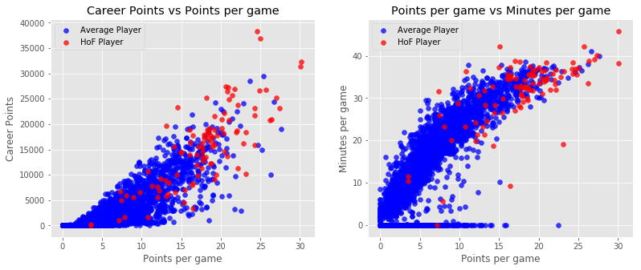

# belgutei.github.io

Data Science Projects

# [Project 1: Basketball Data Analysis](https://github.com/belguteie/Basketball_Analysis) 
* Exploratory data analysis of historical NBA basketball statistics using Python. 
* Logistic Regression Model to predict which NBA players will be voted into the Hall of Fame.
* Data Cleaning, data visualization, feature engineering, and logistic regression model building.
* 89% true positivity rate. 4% false positivity rate.

# [Project 2: Titanic Survival Prediction](https://github.com/belguteie/projects/blob/master/Titanic%20-%20Machine%20Learning.ipynb) 
* Correctly predict if someone survived the Titanic shipwreck.
* Data Cleaning, Data Exploration, Feature Engineering, and Model Building
* Cross-validation of classification methods - Logistic Regression, Decision Tree, K Nearest Neighbors, Random Forest, and Support Vector Classifier
* Best result: 77.99% accuracy (top 15%)

# [Connect with me on LinkedIn](https://www.linkedin.com/in/belguteie/)
